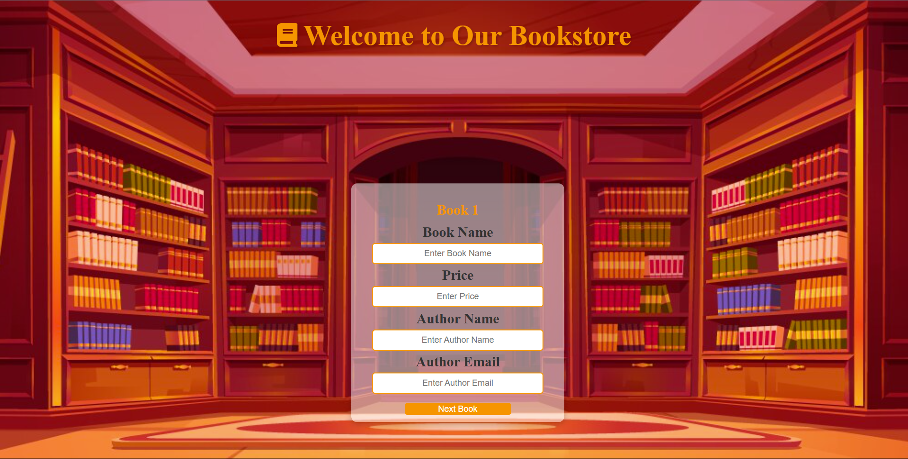

# 📚 Bookstore Reservation Form

Welcome to the **Bookstore Reservation Form**! This web application allows users to enter details for multiple books, validate inputs, and display them in a table.

## 🚀 Features
- User-friendly form for adding multiple books
- Input validation (Book Name, Price, Author Name, Email)
- Edit and delete book entries dynamically
- Responsive design with an animated heading
- Uses **JavaScript (Vanilla), HTML, and CSS**

## 🖥️ Preview

## 📂 Project Structure
